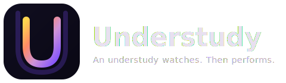

<div align="center">



<br>

**An understudy watches. Then performs.**

[](https://github.com/understudy-ai/understudy/actions/workflows/ci.yml)
[](LICENSE)
[](https://nodejs.org)
[](https://www.npmjs.com/package/@understudy-ai/understudy)
[](https://discord.gg/eyR2dS3f)

[Overview](https://understudy-ai.github.io/understudy/) · [中文展示页](https://understudy-ai.github.io/understudy/zh-CN/index.html) · [Product Design](./docs/Product_Design.md) · [Showcase](#showcase) · [Contributing](#contributing) · [中文 README](./README.zh-CN.md)

</div>

---

AI agents are getting better at terminals, but real work still spans browsers, desktop apps, files, and messaging tools — all with different interfaces, states, and habits.

**Understudy is a general-purpose local agent for your computer.** Give it one instruction and it can research, browse, click through apps, run commands, manage files, and reply through your existing channels.

**It also brings modern computer-use capability without locking you into a subscription product.** Understudy can see the screen and operate software through grounded GUI actions, while still letting you use your own model/API key.

**What makes it distinctive after that is the learning loop.** You can teach by demonstration today, and the same system already carries early crystallization and route-upgrade machinery for repeated work over time.

- **General agent first** — one runtime across GUI, browser, shell, web, files, memory, messaging, scheduling, and subagents.
- **Computer use built in** — grounded desktop operation inside the same local runtime, with your own model/API key.
- **Teach + crystallize + upgrade** — explicit teaching today, plus early workflow crystallization and route-aware replay in one system.

### Why Understudy?

Snapshot as of March 26, 2026. Conservative: sourced from official docs; if a product does not clearly advertise a capability, the wording stays narrow.

| Capability | OpenClaw | Cowork | Vy (Vercept) | Understudy |
|:---|:---|:---|:---|:---|
| GUI / Computer Use | Partial — browser automation | Yes | Yes | **Yes (macOS)** |
| Teach by Demonstration | No | No | Yes ("Watch & Repeat") | **Yes** |
| Multi-Channel Dispatch | 20 + channels | 50 + MCP connectors (not a messaging inbox) | No | **8 built-in messaging channels** |
| Open Source | Yes (MIT) | No | No | **Yes (MIT)** |
| How You Pay | Open-source runtime + own API keys | Pro $20 /mo · Max $100–200 /mo | Discontinued Mar 25 2026 | **Open-source runtime + own API keys** |

<details><summary>Sources</summary>

- **OpenClaw** — [GitHub](https://github.com/openclaw/openclaw) · [browser docs](https://docs.openclaw.ai/tools/browser) · [pricing](https://www.getopenclaw.ai/en/pricing)
- **Cowork** — [pricing](https://claude.com/pricing) · [computer-use announcement](https://claude.com/blog/dispatch-and-computer-use) · [Cowork webinar](https://www.anthropic.com/webinars/future-of-ai-at-work-introducing-cowork)
- **Vy** — [Vercept → Anthropic](https://vercept.com/) · [Watch & Repeat launch](https://vercept.com/changelog/0.3.0) · [workflow updates](https://vercept.com/changelog/0.7.8)
- **Understudy** — this repo (`README`, `docs/`)

</details>

## The Five Layers

Understudy is designed as a layered progression — the same journey a new hire takes when they grow into a reliable colleague.

```
Day 1:    Watches how things are done
Week 1:   Imitates the process, asks questions
Month 1:  Remembers the routine, does it independently
Month 3:  Finds shortcuts and better ways
Month 6:  Anticipates needs, acts proactively
```

That's why it's called **Understudy** — in theater, an understudy watches the lead, learns the role, and steps in when needed.

Each of the five layers maps to a stage of this journey:

```
Layer 1 ┃ Operate Software Natively     Operate any app a human can — see, click, type, verify
────────╋──────────────────────────────────────────────────────────────────────────────────
Layer 2 ┃ Learn from Demonstrations     User shows a task once — agent extracts intent, validates, learns
────────╋──────────────────────────────────────────────────────────────────────────────────
Layer 3 ┃ Crystallized Memory           Agent accumulates experience from daily use, hardens successful paths
────────╋──────────────────────────────────────────────────────────────────────────────────
Layer 4 ┃ Route Optimization            Automatically discover and upgrade to faster execution routes
────────╋──────────────────────────────────────────────────────────────────────────────────
Layer 5 ┃ Proactive Autonomy            Notice and act in its own workspace, without disrupting the user
```

Current status: Layers 1-2 are implemented and usable today. Layers 3-4 are partially implemented. Layer 5 is still the long-term direction.

Every layer depends on the one below it. No shortcuts — the system earns its way up. Read the full story: **[Overview →](https://understudy-ai.github.io/understudy/)** | **[Chinese Overview →](https://understudy-ai.github.io/understudy/zh-CN/index.html)** | **[Product Design →](./docs/Product_Design.md)**

## Showcase

> **Demo environment:** macOS + GPT-5.4 via Codex (OpenAI). All demos also work with Claude, Gemini, and other providers. See [Supported Models](#supported-models) for the full list.

The demos below map to the product story in order: general agent first, computer use next, then teach, and finally a full autonomous pipeline that combines everything.

### General Agent — One Message, Done

[](https://youtube.com/shorts/KObeVm7MK1Y)

This is the starting point: Understudy is first a general-purpose agent. It researches the web, controls your browser, invokes skills, and delivers a polished result — all from a single instruction. No staging, no multi-step prompting. Just say what you need.

> *Example prompt: "Research Cowork and build a tech-style landing page in my downloads folder."*

### Computer Use + Remote Dispatch — Agent on Desktop, You on Phone

[](https://youtu.be/HlTD6Jvm3gk)

This is computer use in practice: send a message from your phone via Telegram, and Understudy receives it on your Mac, converts a file to PDF, opens desktop Telegram, finds the right contact, and sends it — all through GUI automation. The demo shows phone and desktop views side by side.

> *Example prompt: "Convert the Cowork webpage to PDF and send it to Alex on Telegram."*

Understudy works with messaging apps people already use: Telegram, Discord, Slack, WhatsApp, Signal, LINE, iMessage, and Web.

### Teach — Show Once, Refine, Replay with Generalization

[](https://youtube.com/shorts/ZOZU6vb4rRs)

Teach a task by demonstrating it once. Understudy learns the **intent**, not the coordinates — so the skill survives UI redesigns, window resizing, even switching to a different app. Interactively refine the generated skill, then invoke it with natural language. On replay, the agent automatically generalizes: Google Image search becomes browser automation, downloads become shell commands, while native app control (Pixelmator Pro) stays GUI-driven.

> *Demo flow: `/teach start` → search Google Images for Sam Altman → download photo → remove background in Pixelmator Pro → export → send via Telegram to Alex. Then interactively refine the skill. Finally, invoke with natural language: "Find a photo of [person], remove the background, and send it to [contact] on Telegram" — the agent discovers the taught skill and replays it with automatic upgrades.*

See the [published skill from this demo](./examples/published-skills/taught-create-a-background-removed-portrait-for-a-requested-person-and-send-it-in-telegram-cd861a/SKILL.md) for a real example of what teach produces.

### AI App Critic — One Prompt to a Published iPhone App Review

This is everything combined. One prompt triggers a six-stage pipeline: the agent browses the real App Store in Chrome, installs Snapseed on a real iPhone through iPhone Mirroring, explores the app autonomously — discovering background removal and filters it's never seen — composes a narrated vertical video locally with FFmpeg, uploads it to YouTube, and cleans up the device. About one hour, zero human intervention.

The pipeline introduces **workspace artifact composition**: a playbook orchestrates workers (deterministic browser/device automation) and skills (agentic subagents that make their own decisions). Each stage runs as a separate child session with its own context. The middle stage — app exploration — is genuinely agentic: 51 quality-gate rules guide the agent, but it navigates freely through an app it has never seen.

| The published review | How it was made |
|:---:|:---:|
| [](https://youtu.be/jliTvpTnsKY) | [](https://youtu.be/gYMYI0bxkJs) |

> *Example prompt: "Make a Snapseed iPhone app review video from scratch: use the real App Store and iPhone Mirroring, capture proof-first clips focusing on background removal and filters (like black & white), add English narration and subtitles, export a vertical video, upload it unlisted to YouTube, clean up the device, and share the result."*

## Workspace Artifacts — Playbook, Worker, Skill

Understudy's teach and crystallization pipelines can produce three types of workspace artifacts that compose into larger automation:

| Artifact | Role | Execution | Example |
|----------|------|-----------|---------|
| **Skill** | A reusable capability | Agentic — makes its own decisions within quality gates | `app-explore`: freely navigate an unfamiliar iPhone app |
| **Worker** | A deterministic subtask | Scripted — follows a fixed sequence, reports structured output | `appstore-browser-package`: browse App Store, capture listing metadata |
| **Playbook** | A multi-stage orchestrator | Sequences workers and skills as child sessions, manages state across stages | `app-review-pipeline`: 6-stage pipeline from App Store to YouTube |

A playbook spawns each stage as a **subagent** — an independent child session with its own context window and tools. Workers are deterministic: they follow instructions and produce structured output. Skills are agentic: they receive goals and quality gates, then decide how to achieve them. This separation lets a single pipeline mix scripted reliability with genuine autonomy.

```
app-review-pipeline (playbook)
  ├─ Stage 1: appstore-browser-package   (worker)  → Chrome automation
  ├─ Stage 2: appstore-device-install    (worker)  → iPhone Mirroring
  ├─ Stage 3: app-explore               (skill)   → agentic exploration
  ├─ Stage 4: local-video-edit           (skill)   → FFmpeg + Python
  ├─ Stage 5: youtube-upload             (skill)   → Chrome automation
  └─ Stage 6: app-review-cleanup         (skill)   → iPhone Mirroring
```

The artifact type is declared in each SKILL.md's `metadata.understudy.artifactKind` field. The playbook declares its child artifacts, and the E2E test harness validates the full contract — required output files, manifest schema, and stage sequencing.

## What It Can Do Today

### Layer 1 — Operate Your Computer Natively

**Status:** implemented today on macOS.

Understudy is not just a GUI clicker. It's a unified desktop runtime that mixes every execution route your computer offers — in one agent loop, one session, one policy pipeline:

| Route | Implementation | What it covers |
|-------|---------------|----------------|
| **GUI** | 8 tools + screenshot grounding + native input | Any macOS desktop app |
| **Browser** | Managed Playwright + Chrome extension relay attach | Any website, either in a clean managed browser or an attached real Chrome tab |
| **Shell** | `bash` tool with full local access | CLI tools, scripts, file system |
| **Web** | `web_search` + `web_fetch` | Real-time information retrieval |
| **Memory** | Semantic memory across sessions | Persistent context and preferences |
| **Messaging** | 8 channel adapters | Telegram, Slack, Discord, WhatsApp, Signal, LINE, iMessage, Web |
| **Scheduling** | Cron + one-shot timers | Automated recurring tasks |
| **Subagents** | Child sessions for parallel work | Complex multi-step delegation |

The planner decides which route to use for each step. A single task might browse a website, run a shell command, click through a native app, and send a message — all in one session.

**GUI grounding** — dual-model architecture: the main model decides *what* to do, a separate grounding model decides *where* on screen. HiDPI-aware across Retina displays, with automatic high-res refinement for small targets and two grounding modes (simple prediction or multi-round validation with simulation overlays). Grounding benchmark: **30/30 targets resolved** — explicit labels, ambiguous targets, icon-only elements, fuzzy prompts.

For implementation details (coordinate spaces, stabilization, capture modes), see [Product Design](./docs/Product_Design.md).

### Layer 2 — Learn from Demonstrations

**Status:** implemented today. Teach can record a demo, analyze it, clarify the task, optionally validate the replay, and publish a reusable skill.

**Explicit teaching:** you deliberately show the agent how to do a task. Not a macro recorder — Understudy learns **intent**, not coordinates.

```
/teach start                              Start dual-track recording (screen video + semantic events)
                                          → Perform the task once with mouse and keyboard

/teach stop "file the weekly expense report"   AI analyzes the recording → extracts intent, parameters,
                                               steps, success criteria → creates a teach draft
                                               → Multi-turn dialogue to refine the task

/teach confirm [--validate]               Lock the task card; optionally replay to validate

/teach publish <draftId> [skill-name]     Generate SKILL.md → hot-load into active sessions
```

> **Teach privacy note:** demonstration videos, event logs, and traces are stored locally by default. However, teach analysis and GUI grounding may send selected screenshots, keyframes, or other image evidence to your configured model provider.

The published SKILL.md is a three-layer abstraction: intent procedure (natural language steps), route options (preferred / fallback paths), and GUI replay hints (last resort only, re-grounded from the current screenshot each time). UI redesigns, window resizing, even switching to a similar app — as long as the semantic target still exists, the skill works.

The draft/publish pipeline is no longer limited to one artifact shape. The current schema can publish `skill`, `worker`, and `playbook` workspace artifacts, although teach-by-demonstration most commonly produces reusable skills today.

For the full teach pipeline, evidence pack construction, and validation details, see [Product Design](./docs/Product_Design.md).

### Layer 3 — Remember What Worked

**Status:** partially implemented. Understudy now has a working workflow crystallization loop for repeated day-to-day use, but promotion policy and automatic route upgrading are still early.

**Implicit learning:** as you use Understudy day-to-day, it automatically identifies recurring patterns and crystallizes successful paths — no explicit teaching needed:

| Stage | What Happens | User Experience |
|-------|-------------|-----------------|
| Stage 0 | Full exploration | "The AI is figuring it out" |
| Stage 1 | Remembered path | "It's faster than last time" |
| Stage 2 | Deterministic substeps | "It knows the routine" |
| Stage 3 | Crystallized execution | "One-click" |
| Stage 4 | Proactive triggering | "It did it before I asked" |

**What the user experiences today**

- You use Understudy normally; no `/teach` command is required.
- Repeated multi-turn work in the same workspace is compacted in the background.
- Once a pattern repeats often enough, Understudy publishes a workspace skill automatically, hot-loads it into active sessions, and sends a notification that a crystallized workflow is ready.
- From that point on, the agent can pick the new skill through the normal `## Skills (mandatory)` flow, just like a taught skill.

**Current boundaries**

- The learning loop is intentionally conservative: if the pattern is not clear enough, Understudy keeps exploring instead of pretending it has learned it.
- Segmentation, clustering, and skill synthesis are currently LLM-first.
- Promotion thresholds are still heuristic rather than fully policy-driven.
- Layer 4 style route upgrading is still limited; crystallization mainly produces reusable skills today rather than fully automatic route replacement.

For the implementation details (crystallization pipeline, segmentation, clustering, skill synthesis), see [Product Design](./docs/Product_Design.md).

### Layer 4 — Get Faster Over Time

**Status:** partially implemented. Route preferences, teach route annotations, browser auto-fallback, and capability-aware routing are working today. Fully automatic route discovery, promotion, and failure-driven route policies are still in progress.

The same feature can be accomplished in multiple ways. Take "send a Slack message" as an example:

```
Fastest ──→  1. API call         Hit the Slack API directly (milliseconds)
             2. CLI tool         slack-cli send (seconds)
             3. Browser          Type and send in Slack's web app (seconds)
Slowest ──→  4. GUI              Screenshot-ground, click, type in the Slack desktop client (seconds~10s)
```

Starts at GUI on Day 1 — because GUI is the universal fallback that works with any app. As usage accumulates, Understudy progressively discovers faster ways to accomplish the same feature, upgrading after safe verification.

**What the user experiences today**

- The system prompt explicitly steers the agent toward faster routes: direct tool/API > Shell/CLI > browser > GUI.
- Teach-produced skills annotate each step with `preferred` / `fallback` / `observed` routes, so the agent can skip GUI when a faster path is available.
- Browser mode supports both managed Playwright and Chrome extension relay; in `auto` mode it tries the relay first, then falls back to managed Playwright if needed.
- The GUI capability matrix dynamically enables/disables tool subsets based on available permissions, so the agent never attempts a route it can't execute.

For the full route selection mechanisms, upgrade policy, and future direction, see [Product Design](./docs/Product_Design.md).

### Layer 5 — Proactive Autonomy

**Status:** mostly vision today. Scheduling and runtime surfaces exist, but passive observation, isolated workspace, and proactive autonomy are still ahead.

Earned, not assumed. Understudy's ultimate goal isn't "wait for instructions" — it's becoming a colleague that observes long-term, acts proactively.

**Progressive trust model** — each skill starts at `manual`, promoted only through sustained success:

| Level | Behavior |
|-------|----------|
| `manual` | User triggers every run (default) |
| `suggest` | AI suggests, user confirms before execution |
| `auto_with_confirm` | AI executes, user reviews result |
| `full_auto` | AI executes + verifies, notifies only on exceptions |

## Architecture

```
 ┌──────────┐ ┌───────────┐ ┌─────────┐ ┌──────────┐ ┌─────────┐
 │ Terminal  │ │ Dashboard │ │ WebChat │ │ Telegram │ │  Slack  │ ...
 └────┬─────┘ └─────┬─────┘ └────┬────┘ └────┬─────┘ └────┬────┘
      └──────────────┴────────────┴────────────┴────────────┘
                                  │
                    Gateway (HTTP + WebSocket + JSON-RPC)
                                  │
                     ┌────────────┴────────────┐
                     │                         │
              Session Runtime            Built-in Tools
              + Policy Pipeline    ┌──────────────────────┐
                                   │ gui_*  │ browser     │
                                   │ bash   │ memory      │
                                   │ web    │ schedule    │
                                   │ message│ subagents   │
                                   └──────────────────────┘
```

- **Local-first** — screenshots, recordings, and traces are stored locally by default; GUI grounding and teach analysis may send selected images or keyframes to your configured model provider
- **One gateway** — terminal, web, mobile, messaging apps all connect through one endpoint
- **One session runtime** — chat, teach, scheduled tasks, subagents share the same loop
- **Policy pipeline** — every tool call passes through safety, trust, and logging hooks

## Quick Start

### Install from npm

```bash
npm install -g @understudy-ai/understudy
understudy wizard    # walks you through setup
```

### Install from GitHub Packages

```bash
cat >> ~/.npmrc <<'EOF'
@understudy-ai:registry=https://npm.pkg.github.com
//npm.pkg.github.com/:_authToken=YOUR_GITHUB_TOKEN
EOF

npm install -g @understudy-ai/understudy
understudy wizard    # walks you through setup
```

Use a GitHub token with `read:packages` access when installing from GitHub Packages. The bundled `researcher` skill is enabled by default for source-backed multi-source research and fact-checking.

### Install from source

```bash
git clone https://github.com/understudy-ai/understudy.git
cd understudy
pnpm install && pnpm build
pnpm start -- wizard
```

### Start using it

```bash
# Recommended: start the gateway daemon, then use the terminal
understudy daemon --start        # Start the gateway background process (or: understudy gateway --port 23333)
understudy chat                  # Terminal interactive mode (auto-connects to running gateway)

# Management UI
understudy dashboard             # Open the control panel in your browser

# Other entry points
understudy webchat               # Browser chat interface
understudy agent --message "..."  # Script/CI single-turn call (requires gateway)
```

### Requirements

**Required for all installs:**

| Dependency | Install | Purpose |
|------------|---------|---------|
| Node.js >= 20.6 | `brew install node` or [nvm](https://github.com/nvm-sh/nvm) | Core runtime |

**Required for source installs / development:**

| Dependency | Install | Purpose |
|------------|---------|---------|
| pnpm >= 10 | `corepack enable && corepack prepare pnpm@latest --activate` | Workspace package manager |

**macOS GUI automation (required for GUI tools and teach-by-demonstration on macOS):**

| Dependency | Install | Purpose |
|------------|---------|---------|
| Xcode Command Line Tools | `xcode-select --install` | Compiles the Swift native helper (`swiftc`) for screen capture and input events |
| Accessibility permission | See [macOS Permissions](#macos-permissions) | Mouse/keyboard input injection, window queries, demonstration event capture |
| Screen Recording permission | See [macOS Permissions](#macos-permissions) | Screenshots, GUI grounding, demonstration video recording |

**Optional:**

| Dependency | Install | Purpose |
|------------|---------|---------|
| Chrome | [chrome.google.com](https://www.google.com/chrome/) | Extension-relay browser mode — access logged-in tabs. Without it, falls back to Playwright managed browser |
| Playwright | `pnpm exec playwright install chromium` | Managed browser for the `browser` tool. Installed as optional dependency, needs browser binary download |
| ffmpeg + ffprobe | `brew install ffmpeg` | Video analysis for teach-by-demonstration evidence packs |
| signal-cli | `brew install signal-cli` | Signal messaging channel |

## Platform Support

Understudy is currently developed and tested on **macOS**. Core features (CLI, gateway, browser, channels) are cross-platform by design, but native GUI automation and teach-by-demonstration require macOS today. Linux and Windows GUI backends are planned — contributions welcome.

## Supported Models

Understudy is model-agnostic. Configure models with `provider/model` (for example `anthropic/claude-sonnet-4-6`).

The source of truth is the model catalog bundled with your current Understudy runtime plus any custom entries in your local model registry. That catalog evolves over time, so this README intentionally avoids freezing an exhaustive provider/model matrix.

Use one of these to see what your install can actually use:

```bash
understudy models --list
understudy wizard
```

**Auth and provider notes:**

| Provider family | Auth | Notes |
|-----------------|------|-------|
| **Anthropic** | `ANTHROPIC_API_KEY` or OAuth | Claude models available in your current Understudy runtime |
| **OpenAI** | `OPENAI_API_KEY` | GPT-4.x, GPT-5.x, `o*`, and related OpenAI models available in your current Understudy runtime |
| **OpenAI Codex** | `OPENAI_API_KEY` or OAuth | Codex/Responses models such as `gpt-5.4`; shares auth with OpenAI |
| **Google / Gemini** | `GOOGLE_API_KEY` or `GEMINI_API_KEY` | `gemini` is accepted as a provider alias for `google` |
| **MiniMax** | `MINIMAX_API_KEY` | `MiniMax-M2.7`, `MiniMax-M2.7-highspeed`, `MiniMax-M2.5`, `MiniMax-M2.5-highspeed`; use `minimax-cn` provider for the China endpoint |
| **Additional compatible providers** | Provider-specific auth | Depending on your current Understudy runtime, examples may include GitHub Copilot, OpenRouter, xAI, Mistral, Groq, Bedrock, Vertex, and more |
| **Custom providers / models** | Provider-specific auth | You can add custom model entries through the underlying model registry |

Default: `openai-codex/gpt-5.4`. The wizard chooses from models detected in your local runtime auth/model registry.

## macOS Permissions

Full screenshot-grounded GUI automation on macOS depends on the native helper plus two system permissions. Missing permissions degrade or hide parts of the GUI toolset rather than failing every GUI capability equally.

### Accessibility

**What it enables:** Mouse clicks, typing, drag, scroll, key presses/shortcuts, absolute cursor moves, and demonstration event capture.

**If missing:** Input-driving tools are blocked. Observation-oriented tools such as `gui_observe` may still work when Screen Recording is available.

**How to grant:**

1. Open **System Settings → Privacy & Security → Accessibility**
2. Click the **+** button, add your terminal app (Terminal.app, iTerm2, VS Code, etc.)
3. Toggle it **on**

### Screen Recording

**What it enables:** Screenshot capture for `gui_observe`, GUI grounding/verification, and demonstration video recording.

**If missing:** Screenshot-grounded tools are blocked. Keyboard/input-only routes such as `gui_key` and `gui_move` still remain available, while `gui_scroll` and `gui_type` can still operate in targetless mode.

**How to grant:**

1. Open **System Settings → Privacy & Security → Screen Recording**
2. Click the **+** button, add your terminal app
3. Toggle it **on**
4. Restart your terminal app for the permission to take effect

> Both permissions must be granted to the terminal application that runs `understudy`, not to Understudy itself.
>
> If GUI behavior still looks partial after granting permissions, run `understudy doctor --deep` to check the native helper, grounding availability, browser runtime, and teach-analysis dependencies.

## Skills

Built-in skills + workspace skills you create or install.

```bash
understudy skills --list                    # browse available skills
understudy skills install <name-or-url>     # install from registry or URL

# Or teach by demonstration
/teach start → demonstrate → /teach stop → /teach confirm
→ /teach publish <draftId>
# Optional: /teach validate <draftId> before or after publish
```

## Channels

8 built-in channel adapters: Web, Telegram, Discord, Slack, WhatsApp, Signal, LINE, iMessage.

```bash
understudy channels --list
understudy channels --add telegram
```

## Repository Layout

```
apps/cli           CLI entrypoints, 20+ operator commands
packages/core      Agent session runtime, config, auth, skills, policies
packages/gateway   HTTP + WebSocket gateway, session runtime, web surfaces
packages/gui       Native GUI runtime, screenshot grounding, demo recorder
packages/tools     Built-in tools: browser, web, memory, schedule, GUI, message
packages/channels  Channel adapters (8 platforms)
packages/types     Shared TypeScript type definitions
skills/            Built-in skill modules
examples/          Teach demo and published skill example
docs/              Vision, product design documentation
```

## Development

```bash
pnpm install          # install dependencies
pnpm build            # build all packages
pnpm test             # run tests
pnpm lint             # lint with oxlint
pnpm typecheck        # type-check all packages
pnpm check            # full validation: build + lint + typecheck + test
```

## Star History

[](https://star-history.com/#understudy-ai/understudy&Date)

## Acknowledgments

Understudy builds on ideas and code from several outstanding open-source projects:

| Project | What we learned |
|---------|----------------|
| [OpenClaw](https://github.com/openclaw/openclaw) | Gateway architecture, multi-channel design, skill ecosystem patterns |
| [pi-mono](https://github.com/badlogic/pi-mono) | Agent core runtime, unified LLM API, TUI infrastructure |
| [NanoClaw](https://github.com/nanoclaw/nanoclaw) | Minimal agent design, extension patterns |
| [OSWorld](https://github.com/xlang-ai/OSWorld) | GUI agent benchmarking methodology, computer use evaluation |
| [openai-cua-sample-app](https://github.com/openai/openai-cua-sample-app) | Computer use agent reference patterns |

Special thanks to [Mario Zechner](https://github.com/badlogic) for the `pi-agent-core` foundation that powers Understudy's agent loop.

## Contributors

Thanks to everyone who has contributed to Understudy.

<a href="https://github.com/understudy-ai/understudy/graphs/contributors">
  
</a>

## Contributing

See [CONTRIBUTING.md](./CONTRIBUTING.md) for guidelines.

We're looking for contributors in these areas:

- **GUI backends** — Linux (AT-SPI) and Windows (UIA) native GUI support
- **Skills** — new skill modules for popular apps and workflows
- **Route discovery** — automatic API detection and upgrade logic (Layer 4)
- **Teach improvements** — better evidence pack analysis and validation
- **Documentation & translations**

## License

[MIT](./LICENSE)

---

<div align="center">

**Watch → Learn → Remember → Optimize → Anticipate**

*That's the whole product.*

</div>
